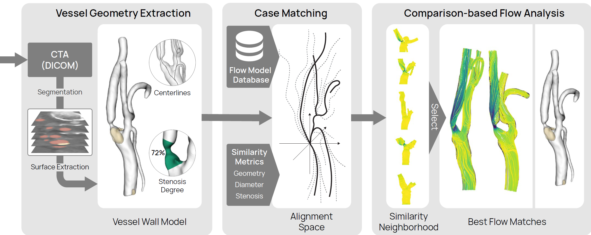

# Carotid Analyzer $-$ FlowComp Extension

Extension to the CarotidAnalyzer pipeline for blood flow analysis using morphological similarity.



## Database
The carotid bifurcation and flow model database is available at: [https://doi.org/10.5281/zenodo.7634643](https://doi.org/10.5281/zenodo.7634643).

> Note that the database contains only the reconstructed models, centerlines, and simulated flow. The CTA scans are not public to preserve patient privacy.

## Files

- `modules` All module widgets and associated classes are contained here.
  - `CenterlineModule.py` Module for generating centerlines.
  - `CropModule.py` Module for cropping CTA volumes.
  - `FlowCompModule.py` Module for interactive flow analysis.
  - `Interactors.py` Image and 3D interactors shared across modules.
  - `Predictor.py` CNN for plaque/lumen label prediction.
  - `SegmentationModule.py` Module for segmenting cropped images.
  - `StenosisClassifier.py` Module for interactive stenosis classification.
- `scripts` Additional scripts for testing purposes, *not* referenced in the application.
- `ui` UI and resource source files for Qt Designer, *not* referenced in the application.
  - `resources` Contains applications icons etc.
  - `mainwindow.ui` Qt Designer UI file.
  - `resources.qrc` Qt Designer resource file.
- `CarotidAnalyzer.py` Main application, run this for execution.
- `defaults.py` Global constants (colors, symbols...)
- `mainwindow_ui.py` Compiled UI file.
- `resources_rc.py` Compiled resource file.
- `seg_model_weights.pth` CNN weights trained for carotid bifurcation lumen and plaque labelling.

## Setup

### Dependencies

- Python 3.10
- numpy 1.23
- pyqt 5.15 (GUI)
- pyqtgraph 0.13 (graphs)
- vtk 9.1 (rendering)
- vmtk 1.5 (centerline computation)
- pytorch 1.13 with monai and scikit-image (segmentation prediction)
- pydicom 2.3 with gdcm (for compressed DICOM I/O)
- pynrrd 0.4 (vtk can only read not write nrrd files)

### Setup with Anaconda

With a CUDA-enabled GPU:

```bash
conda create -n CarotidAnalyzer python=3.10 pytorch torchvision torchaudio pytorch-cuda=11.7 -c pytorch -c nvidia
```

> **or** install Pytorch for CPU only:
>
> ```bash
> conda create -n CarotidAnalyzer python=3.10 pytorch torchvision torchaudio cpuonly -c pytorch
> ```
> See also the [PyTorch](https://pytorch.org/get-started/locally/) installation instructions.

Then, install the other packages:

```bash
conda activate CarotidAnalyzer
conda install -c conda-forge monai pyqt pyqtgraph vtk vmtk pydicom pynrrd
conda install scikit-image
pip install python-gdcm
```

The main application can now be run and modified.

## First Steps

1. Use `File -> Set Working Directory` to chose the folder for the patient database. Each case receives a named folder. Module input/output is saved using industry standard formats, so they can be easily externally accessed. For example, the segmentation files can be opened and edited with 3D Slicer.
2. Any existing cases will be shown in the data inspector module. Double-click a case to load it or choose `Load Selected Patient`.
3. To import new cases, use `File -> Load New DICOM` to create a new case subfolder and import a DICOM series (should be an axially resolved head/neck CTA). Choose the folder containing the series. Uncompressed  DICOM files are handled natively. Compressed files are handled by pydicom with numpy and GDCM, which enables import of most JPEG compression formats. See [this list](https://pydicom.github.io/pydicom/stable/old/image_data_handlers.html#guide-compressed) for a complete overview of supported formats.
4. The pipeline can now be used on the new data. The application will ask if the full volume should be saved or only temporalily loaded. Saving full volumes may take 100-200 MB of disk space. If you do not intend to change the crop region later, saving can be omitted.
5. Inside the working directory, a folder named `flow_data` should contain the database models with hemodynamic simulations that are used in the FlowComp module. The following files are accepted:
  - `patient*_left_lumen_centerlines.vtp` / `patient*_right_lumen_centerlines.vtp`: Centerline geometries with radius information.
  - `patient*_left_wss.vtu` / `patient*_right_wss.vtu`: WSS fields with wall geometry.
  - `patient*_left_velocity_diastolic.vtp` / `patient*_left_velocity_diastolic.vtp` / `patient*_right_velocity_systolic.vtp` / `patient*_right_velocity_systolic.vtp`: Streamlines of diastolic/systolic velocity fields.
  - `patient*_left_wss_map_images.npz` / `patient*_right_wss_map_images.npz`: Texture cache for vessel maps.
