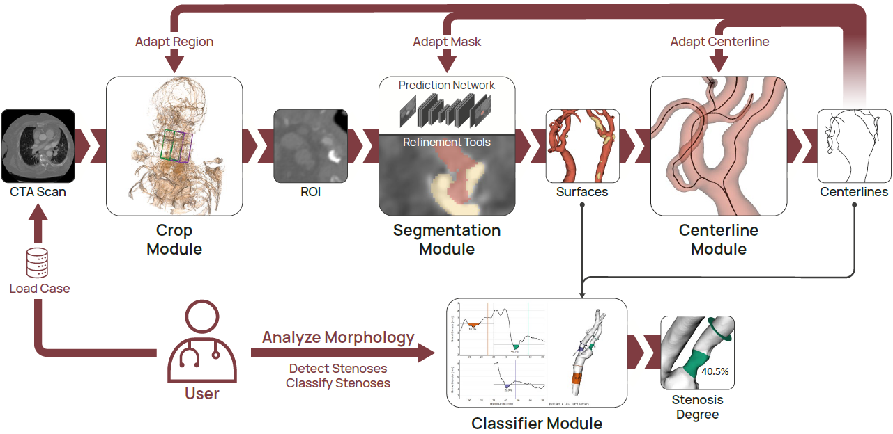

# Carotid Analyzer

A full pipeline for cropping, model extraction, centerline computation, and interactive visualization of carotid artery geometries.



## Database
The carotid bifurcation model database is available at: [https://doi.org/10.5281/zenodo.7634644](https://doi.org/10.5281/zenodo.7634644). After download, it can be used as a target folder for the application.

> Note that the database contains only the reconstructed models and centerlines. The CTA scans are not public to preserve patient privacy.

## Files

- `modules` All module widgets and associated classes are contained here.
  - `CenterlineModule.py` Module for generating centerlines.
  - `CropModule.py` Module for cropping CTA volumes.
  - `Interactors.py` Image and 3D interactors shared across modules.
  - `Predictor.py` CNN for plaque/lumen label prediction.
  - `SegmentationModule.py` Module for segmenting cropped images.
  - `StenosisClassifier.py` Module for interactive stenosis classification.
- `scripts` Additional scripts for testing purposes, *not* referenced in the application.
- `ui` UI and resource source files for Qt Designer, *not* referenced in the application.
  - `resources` Contains applications icons etc.
  - `mainwindow.ui` Qt Designer UI file.
  - `resources.qrc` Qt Designer resource file.
- `CarotidAnalyzer.py` Main application, run this for execution.
- `defaults.py` Global constants (colors, symbols...)
- `mainwindow_ui.py` Compiled UI file.
- `resources_rc.py` Compiled resource file.
- `seg_model_weights.pth` CNN weights trained for carotid bifurcation lumen and plaque labelling.

## Setup

### Dependencies

- Python 3.10
- numpy 1.23
- pyqt 5.15 (GUI)
- pyqtgraph 0.13 (graphs)
- vtk 9.1 (rendering)
- vmtk 1.5 (centerline computation)
- pytorch 1.13 with monai and scikit-image (segmentation prediction)
- pydicom 2.3 with gdcm (for compressed DICOM I/O)
- pynrrd 0.4 (vtk can only read not write nrrd files)

### Setup with Anaconda

With a CUDA-enabled GPU:

```bash
conda create -n CarotidAnalyzer pytorch torchvision torchaudio pytorch-cuda=11.7 -c pytorch -c nvidia
```

> **or** install Pytorch for CPU only:
>
> ```bash
> conda create -n CarotidAnalyzer pytorch torchvision torchaudio cpuonly -c pytorch
> ```
> See also the [PyTorch](https://pytorch.org/get-started/locally/) installation instructions.

Then, install the other packages:

```bash
conda activate CarotidAnalyzer
conda install -c conda-forge monai pyqt pyqtgraph vtk vmtk pydicom pynrrd
conda install scikit-image
pip install python-gdcm
```

The main application can now be run and modified.

## First Steps

1. Use `File -> Set Working Directory` to chose the folder for the patient database. Each case receives a named folder. Module input/output is saved using industry standard formats, so they can be easily externally accessed. For example, the segmentation files can be opened and edited with 3D Slicer.
2. Any existing cases will be shown in the data inspector module. Double-click a case to load it or choose `Load Selected Patient`.
3. To import new cases, use `File -> Load New DICOM` to create a new case subfolder and import a DICOM series (should be an axially resolved head/neck CTA). Choose the folder containing the series. Uncompressed  DICOM files are handled natively. Compressed files are handled by pydicom with numpy and GDCM, which enables import of most JPEG compression formats. See [this list](https://pydicom.github.io/pydicom/stable/old/image_data_handlers.html#guide-compressed) for a complete overview of supported formats.
4. The pipeline can now be used on the new data. The application will ask if the full volume should be saved or only temporalily loaded. Saving full volumes may take 100-200 MB of disk space. If you do not intend to change the crop region later, saving can be omitted.

## Implementing Extensions

Extension modules that are a subclass of [QWidget](https://doc.qt.io/qtforpython-5/PySide2/QtWidgets/QWidget.html) can be integrated directly, analogous to the existing modules.

Use Qt's signal/slot mechanism for pipeline communication:

- Implement a `loadPatient(active_patient_dict)` method that reads all required files if they are present. The `active_patient_dict` is supplied by the application, it provides the filepaths of all files for the active case. See `CarotidAnalyzer.py -> setWorkingDir(dir)` for a list of the dictionary keys and file signatures and to append any new file signatures.
- When data is edited, the `data_modified` signal should be triggered. It informs the application that changes were made and enables the save/discard actions.
- Implement a `save()` method that saves modified data. The `save()` method of the active module is called when the save action is triggered by the user. 
- Implement a `discard()` method that resets modifications. The `discard()` method of the active module is called when the discard action is triggered by the user.
- Check/modify methods in the application called `newSegmentaion(), newModels()...`. These are called if a new file of the respective type exists and propagate the changes to later pipeline stages.

## GUI Dev with Qt Designer

This section is only relevant to modify the main UI of the application. The UI of the modules can be implemented directly.

The `ui` folder is not visible to the application! Do not reference any resources within it directly. The UI and resources are compiled to python files which can be directly imported.

For GUI development with the Qt Designer also install the pyqt5-tools

```bash
conda activate CarotidAnalyzer
pip install pyqt5-tools
```

Run the Qt Designer with the CarotidAnalyzer environment active

```bash
designer
```

Modify UI `.ui` and Qt resource `.qrc` files. On Windows, compile them with

```bash
cd C:\Users\<username>\.conda\envs\CarotidAnalyzer\Scripts
pyuic5.exe <your path>\carotidanalyzer\ui\mainwindow.ui -o <your path>\carotidanalyzer\mainwindow_ui.py
pyrcc5.exe <your path>\carotidanalyzer\ui\resources.qrc -o <your path>\carotidanalyzer\resources_rc.py
```

On other platforms, just use the `pyuic5`/`pyrcc5` commands (no .exe) with the CarotidAnalyzer environment active.
